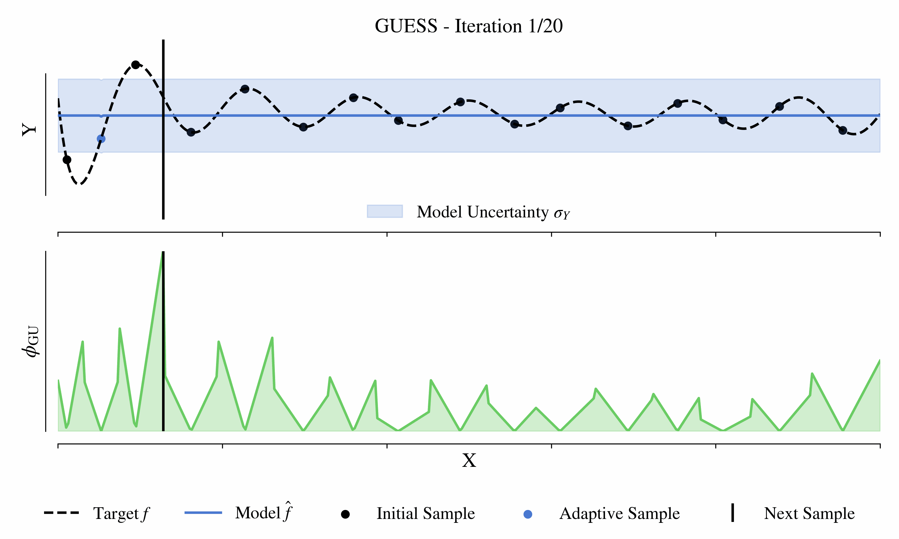

GALe - A Python Library for Global Adaptive Learning
====================================================



## What is it?
**GALe** is a Python package providing tools for using 
adaptive sampling strategies to create globally accurate
surrogate models for single response problems in the 
noiseless setting. This repository contains also the code for the paper 
[Gradient and Uncertainty Enhanced Sequential Sampling for Global Fit](https://www.sciencedirect.com/science/article/pii/S004578252300350X) by Sven Lämmle, Can
Bogoclu, Kevin Cremanns and Dirk Roos published in Computer Methods in Applied Mechanics 
and Engineering, Volume 415, 2023.

## Installation & Requirements
After cloning the repository, the package, and it's dependencies can be 
installed from inside the main directory with:
```
# PyPI
pip install -e .
```
However, installing pygmo is advised via conda-forge (see [Link](https://esa.github.io/pygmo2/install.html)):
```
conda install -c conda-forge pygmo=2.18
```

## How to run experiments
Experiments can be run using:
```
python gale/experiments/ex_run.py
    -m      MODEL       (required)  The name of the model. Select from [GP, SGP, BNN].
    -b      BENCHMARK   (optional)  Override the conducted benchmarks from the config file
                                    (see section below for options).
    -p      PARALLEL    (optional)  Maximum number of running jobs.
    -c      CONFIG      (optional)  Exp. config file (see section below on overrides).
    -logdir LOGDIR      (optional)  Directory to which results will be saved 
                                    (default: gale/experiments/results)
```
To run experiments with default arguments to reproduce our results (some deviations can  
occur since we run our experiments parallelized with p=10), only specify the model 
(and optionally a log directory). For example: `python gale/experiments/ex_run.py -m GP`.
Results will be saved in `<logdir>/<model>/`. 

### Benchmark
**GALe** implements different benchmark functions from optimization literature. 
For an overview see `gale/experiments/bench_functions.py`.
Benchmarks can be run as groups (e.g. [1D, 2D, 3D, ...]), individual (e.g. [Micha2d, Ackley4d, ...]) 
or all at once with `all` (high dimensional have to be run separate).

### Config
.json files are used for experiment configuration. To override the default configuration 
create a .json file and pass the file path. The file should contain the following structure:
```
{"bench_config": BENCHMARKS,            - see Benchmark
"ex": {"repetitions": int,              - num. of repetitions for each method
       "save_pred": bool,               - If True, saves each prediction for test samples in results
       "save_pred_sep": bool,           - If True, saves each prediction for test samples separate
       "model_param": {BENCHMARK: {"net_config": NET_CONFIG},
                                  ...,
                                  }
       },
"eval": {}          
```

## Contained Sampling Strategies

### Global Modeling

- MMSE: Maximum Mean Square Error (J. Sacks, et al. - Design and Analysis of Computer Experiments, 1989)
- wMMSE: Weighted Maximum Mean Square Error (A. Kyprioti et al. - Adaptive design of experiments for global Kriging metamodeling through cross-validation information, 2020)
- EIGF: Expected Improvement for Global Fit (C. Lam - Sequential Adaptive Desings in Computer Experiments for Response Surface Model Fit, 2008)
- GUESS: Gradient and Uncertainty Enhanced Sequential Sampling (S. Lämmle, et al. - Gradient and Uncertainty Enhanced Sequential Sampling for Global Fit, 2023)
- GGESS: Gradient and Geometry Enhanced Sequential Sampling (X. Chen, et al. - An effective gradient and geometry enhanced sequential sampling approach for Kriging modeling, 2021)
- MEPE: Maximizing Expected Prediction Error (H. Liu, et al. - An adaptive sampling approach for Kriging metamodeling by maximizing expected prediction error, 2017)
- MASA: Mixed Adaptive Sampling Algorithm (J. Eason, et al. - Adaptive sequential sampling for surrogate model generation with artificial neural networks, 2014)
- TEAD: Taylor-Expansion based Adaptive Design (S. Mo, et al. - A Taylor Expansion-Based Adaptive Design Strategy for Global Surrogate Modeling With Applications in Groundwater Modeling, 2017)
- DL-ASED: Discrepancy Criterion and Leave One Out Error-based Adaptive Sequential Experiment Design (K. Fang, et al. - An adaptive sequential experiment design method for model validation, 2019)

### Global Optimization

- EI: Expected Improvement (D. Jones, et al. - Efficient Global Optimization of Expensive Black-Box Functions, 1998)

## Citation

If this repo helped your research, I would appreciate you citing:
```
@article{LAMMLE2023116226,
title = {Gradient and uncertainty enhanced sequential sampling for global fit},
journal = {Computer Methods in Applied Mechanics and Engineering},
volume = {415},
pages = {116226},
year = {2023},
issn = {0045-7825},
doi = {10.1016/j.cma.2023.116226},
url = {https://www.sciencedirect.com/science/article/pii/S004578252300350X},
author = {Sven Lämmle and Can Bogoclu and Kevin Cremanns and Dirk Roos},
keywords = {Adaptive sampling, Bayesian optimization, Design of experiments, Gaussian process, ANN},
abstract = {Surrogate models based on machine learning methods have become an important part of modern engineering to replace costly computer simulations. The data used for creating a surrogate model are essential for the model accuracy and often restricted due to cost and time constraints. Adaptive sampling strategies have been shown to reduce the number of samples needed to create an accurate model. This paper proposes a new sampling strategy for global fit called Gradient and Uncertainty Enhanced Sequential Sampling (GUESS). The acquisition function uses two terms: the predictive posterior uncertainty of the surrogate model for exploration of unseen regions and a weighted approximation of the second and higher-order Taylor expansion values for exploitation. Although various sampling strategies have been proposed so far, the selection of a suitable method is not trivial. Therefore, we compared our proposed strategy to 9 adaptive sampling strategies for global surrogate modeling, based on 26 different 1 to 8-dimensional deterministic benchmarks functions. Results show that GUESS achieved on average the highest sample efficiency compared to other surrogate-based strategies on the tested examples. An ablation study considering the behavior of GUESS in higher dimensions and the importance of surrogate choice is also presented.}
}
```

- Article: [Elsevier Computer Methods in Applied Mechanics and Engineering](https://www.sciencedirect.com/science/article/pii/S004578252300350X)
- Preprint: [ArXiv](https://arxiv.org/abs/2310.00110)

## Contribution
All contributions are welcome. Feel free to contact me.